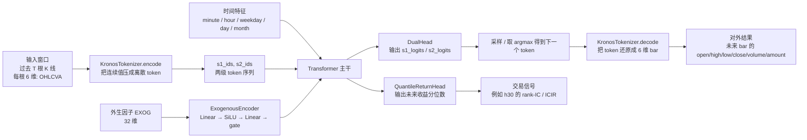

# Kairos

> 抓住 **正确的时机**。
>
> **Kairos** 是基于 [Kronos](https://github.com/shiyu-coder/Kronos) 基础模型的**多市场微调 + 部署工具箱**。
> 开箱即用的数据采集、因子工程、外生通道扩展、分位回归头、跨市场回测、HuggingFace 一键上传和 FastAPI 推理服务。

<p align="center">
<em>Kronos 管时间 · Kairos 管机会</em>
</p>

---

## ✨ 特性

- **多市场数据层** — 统一 `MarketAdapter` 抽象，内置 A 股（akshare 多源 fallback）、加密货币（ccxt OKX 永续 / Binance Vision 镜像）两个 adapter，可扩展到 Binance / Bybit / 外汇 / 黄金等
- **共享因子 schema** — 24 维通用因子 + 8 维市场专属因子 = 固定 32 维 `EXOG_COLS`，**同一个模型 checkpoint 跨市场通用**，无未来信息泄漏
- **模型** — `KronosWithExogenous`：在 Kronos 之上加外生变量旁路通道 + 分位回归头，**完全兼容预训练权重**（147 层里 136 层直接 reuse）
- **训练** — `torchrun` 启动的 DDP 训练，渐进解冻 + 早停 + OneCycleLR + pinball loss；全量 env override（`KAIROS_BATCH_SIZE` 等）无需改代码就能调参
- **回测** — `backtest_ic` 直接吃 `meta.json` 自动推 market/freq，支持 `--baseline` 拿 Kronos 原权重做对比，输出 overall / by-date / by-hour 三种 bucket 的 IC / Rank-IC / ICIR
- **部署** — 一键 push 到 Hugging Face Hub + FastAPI 实时推理服务

---

## 📈 核心成果

### 加密货币 1-min 微调

**四次 run 的 h30 对比**（horizon 对齐 preset `return_horizon=30`；硬件：单卡 RTX 5090）：

| run | universe | 训练区间 | test 样本 | rank-IC (baseline → finetuned) | **ICIR (baseline → finetuned)** | hit_rate | 详情 |
|---|---|---|---|---|---|---|---|
| 2026-04-17 | BTC + ETH（2 币） | 2024-01 ~ 2026-04 | 30 万 | +0.018 → **+0.050** | +0.039 → **+0.325** | 51.7% | [CRYPTO_BTC_ETH_RUN.md](docs/CRYPTO_BTC_ETH_RUN.md) |
| 2026-04-20 | Binance Spot Top100（100 币） | 2025-04 ~ 2026-04 | 110 万 | +0.000 → **+0.030** | −0.084 → **+0.454** | 49.2% | [CRYPTO_TOP100_RUN.md](docs/CRYPTO_TOP100_RUN.md) |
| 2026-04-21 | BTC + ETH（2 币，`Kronos-base`） | 2024-01 ~ 2026-04 | 30 万 | +0.055 → **+0.076** | +0.325 → **+0.484** | 52.9% | [Shadowell/Kairos-base-crypto](https://huggingface.co/Shadowell/Kairos-base-crypto) |
| 2026-04-20 ⚠️ | OKX **永续 Top10**（首次拿到真实 funding/basis） | 2026-03-21 ~ 2026-04-17（30d） | 4 万 | +0.008 → +0.016 (n=3 噪声) | +1.17 → +0.06 (n=3 噪声) | 50.9% | [CRYPTO_PERP_TOP10_30D.md](docs/CRYPTO_PERP_TOP10_30D.md)（**post-mortem**）|

- **ICIR 从 0.325 再抬到 0.454**（+40%）—— Top100 把信号的稳定性推过 0.4 线；对组合化使用是最看重的指标。
- **`Kronos-base` 在同一套 BTC/ETH 数据上继续抬升到 `rank-IC=+0.076 / ICIR=+0.484`**，说明当前瓶颈不只是 universe，模型容量本身也在起作用。
- rank-IC 绝对值从 5% 掉到 3%：Top100 里很多小币的 30-min 方向性弱于 BTC/ETH，单券方向 alpha 被稀释，横截面相对强弱 alpha 更凸显。
- **h1 / h5 两次 run 结果都不理想**：binance_vision 镜像没有 funding / OI / basis，短 horizon 最吃的微观因子被 pad 为 0；Top100 run 里 h1/h5 甚至被模型学成反向信号，详见 CRYPTO_TOP100_RUN.md §7.5。修正方向见文档 §11。
- **永续 Top10 30d run（⚠️）链路打通了**——首次把 OKX 真实非零 `funding_rate` 和 `basis` 喂进 32 维 exog；但训练效果是负迁移，root cause 是 `KAIROS_N_TRAIN_ITER=5000` 残留 + test 区只 3 天 + bucket 选错三层叠加，**代码本身没 regression**（用老数据复跑老结果通过）。完整 post-mortem 见 [CRYPTO_PERP_TOP10_30D.md](docs/CRYPTO_PERP_TOP10_30D.md)，也能当 "怎么读 IC 报告" 的反面教材；正面教材是 [BACKTEST_IC_GUIDE.md](docs/BACKTEST_IC_GUIDE.md)。

### A 股日线（对比基线）

训了两版（time-split v1 + interleave-split v2），test IC 都为负，结论：在现成 EXOG schema 下 A 股日线信号偏弱。下一步方向（调权重冻结策略、改监督信号、换到分钟级）写在 [docs/TUNING_PLAYBOOK.md](docs/TUNING_PLAYBOOK.md)。

### 已发布模型

| Hub repo | 数据 | base model | 说明 |
|---|---|---|---|
| [`Shadowell/Kairos-small-crypto`](https://huggingface.co/Shadowell/Kairos-small-crypto) 🟢 public | BTC/USDT + ETH/USDT 1-min, 2024-01 ~ 2026-04 | [`NeoQuasar/Kronos-small`](https://huggingface.co/NeoQuasar/Kronos-small) | 上表 h30 那行的 checkpoint；tokenizer 复用上游 [`NeoQuasar/Kronos-Tokenizer-base`](https://huggingface.co/NeoQuasar/Kronos-Tokenizer-base) |
| [`Shadowell/Kairos-base-crypto`](https://huggingface.co/Shadowell/Kairos-base-crypto) 🟢 public | BTC/USDT + ETH/USDT 1-min, 2024-01 ~ 2026-04 | [`NeoQuasar/Kronos-base`](https://huggingface.co/NeoQuasar/Kronos-base) | `Kronos-base` predictor 微调版；官方 tokenizer；当前 h30 `rank-IC=+0.076 / ICIR=+0.484` |

```python
from kairos import KronosTokenizer
from kairos.models import KronosWithExogenous

tok   = KronosTokenizer.from_pretrained("NeoQuasar/Kronos-Tokenizer-base")
model = KronosWithExogenous.from_pretrained("Shadowell/Kairos-small-crypto")
```

---

## 🏗️ 架构

### 数据流水线（多市场）

```
 ┌────────────┐   ┌──────────────┐   ┌───────────────────┐
 │ akshare /  │   │ ccxt (OKX    │   │ data-api.binance  │
 │ 东财 /腾讯 │   │ 永续,默认)   │   │ .vision (现货镜像)│   … 其他 adapter
 │ 新浪       │   │              │   │                   │
 └─────┬──────┘   └──────┬───────┘   └─────────┬─────────┘
       │ ashare          │ crypto (okx)        │ crypto (binance_vision)
       ▼                 ▼                     ▼
 ┌─────────────────────────────────────────────────────────┐
 │           MarketAdapter 抽象（kairos.data.markets）      │
 │  • FetchTask / universe / fetch_ohlcv / MARKET_EXOG_COLS │
 └──────────────────────┬──────────────────────────────────┘
                        │   kairos-collect  (--market)
                        ▼
              raw/{market}/{freq}/<symbol>.parquet
                        │
                        ▼
     ┌──────────────────────────────────────────────┐
     │ kairos.data.common_features   24 维通用因子  │
     │ adapter.market_features        8 维市场因子  │
     │ ──────────────── = EXOG_COLS (固定 32 维) ── │
     │ kairos.data.prepare_dataset   (含 meta.json) │
     └────────────────────┬─────────────────────────┘
                          │
                          ▼
       finetune/data/<name>/{train,val,test}_data.pkl + exog_*.pkl + meta.json
```

### 训练 + 回测 + 部署

```
 ┌────────────────────────────┐    ┌────────────────────────────┐
 │ kairos.training            │    │ kairos.training            │
 │ .train_tokenizer  (可选)   │    │ .backtest_ic               │
 │ .train_predictor           │    │  --baseline  vs  --ckpt    │
 │  ├── preset_for(name)      │    │  自动从 meta.json 推       │
 │  │    ashare-daily /       │    │  market / freq / exog      │
 │  │    crypto-1min          │    │  输出 overall + by-date +  │
 │  ├── DDP (torchrun)        │    │  by-hour 三档 bucket       │
 │  ├── 渐进解冻 + OneCycleLR │    └──────────────┬─────────────┘
 │  ├── 早停 patience=3       │                   │
 │  └── KAIROS_* env 覆盖参数 │                   ▼
 └──────────────┬─────────────┘          artifacts/backtest_*.json
                │
                ▼
   artifacts/checkpoints/predictor/checkpoints/best_model/
                │
       ┌────────┴─────────┐
       ▼                  ▼
 kairos.deploy      kairos.deploy
 .push_to_hf        .serve
 (HF Hub)           (FastAPI /predict)
```

### Kairos vs Kronos：数据维度对比

Kairos 的数据入口与 Kronos 原版**完全向后兼容**——只在原有两条通道之外额外多了一条旁路外生变量通道 `EXOG`（默认 32 维）和一个分位回归头，不改动 tokenizer 的 `d_in`。

| 通道 | Kronos 原版 | Kairos | 融合方式 |
|---|---|---|---|
| **价量**（tokenizer `d_in`） | 6 维：`open, high, low, close, volume, amount` | **6 维（不变）** | → `KronosTokenizer` BSQ 量化为 `(s1_bits, s2_bits)` token |
| **时间戳**（TemporalEmbedding） | 5 维：`minute, hour, weekday, day, month` | **5 维（不变）** | → 在 transformer 输入端**加**到 token embedding 上 |
| **外生因子**（ExogenousEncoder） | — | **32 维 `EXOG_COLS`** = 24 通用 + 8 市场专属 | → `Linear→SiLU→Linear→RMSNorm→gate·tanh`，与 token + time embedding **相加**；`gate` **零初始化**，第一步等价 Kronos |
| **预测头** | next-token CE（s1/s2 双头） | **CE（不变）** + `QuantileReturnHead`（分位回归头，方案 C） | `CE + quantile_weight · pinball` 联合损失 |

### 输入 / 输出长什么样

Kairos / Kronos **对外可解码成未来 K 线 bar 的 6 维连续值**，但**模型内部直接输出的不是 6 维实数回归值，而是离散 token 的概率分布**。原因是 `KronosTokenizer` 会先把每根 bar 的 `open, high, low, close, volume, amount` 压成两级 token（`s1`, `s2`），predictor 学的是"下一个 token 是什么"，再把 token 解码回连续 K 线。



一个 `crypto-1min` 样本在进入模型前，大致可以理解为：

- `x`: `[289, 6]`，其中 `289 = lookback_window 256 + predict_window 32 + 1`
- `stamp`: `[289, 5]`
- `exog`: `[289, 32]`

训练时 tokenizer 会先把 `x` 编成 `s1_ids` / `s2_ids`，然后真正喂给 predictor 的是移位后的：

- `s1_in`, `s2_in`: 过去 token 序列
- `stamp_in`: 对齐的时间特征
- `exog_in`: 对齐的 32 维外生因子

模型的直接输出分两路：

- `s1_logits`, `s2_logits`：下一个 token 的概率分布，用来生成 / 解码未来 K 线 bar
- `quantiles`：未来收益分位数，用来做 `h30` 这类回测信号

32 维 `EXOG_COLS` 的具体构成（代码在 [`kairos/data/common_features.py`](kairos/data/common_features.py) 和 `kairos/data/markets/<name>.py`）：

| 分组 | 维度 | 列名（节选） |
|---|---|---|
| 通用 · 收益率 | 3 | `log_ret_1 / 5 / 20` |
| 通用 · 动量 | 4 | `rsi_14, macd_hist, roc_5, roc_20` |
| 通用 · 波动率 | 3 | `atr_14, parkinson_20, vol_std_20` |
| 通用 · 均线偏离 | 3 | `ma{5,20,60}_dev` |
| 通用 · 布林 / 量价 | 5 | `boll_z, obv_z, mfi_14, amount_z, vwap_dev` |
| 通用 · 蜡烛微观结构 | 4 | `amplitude, upper_shadow, lower_shadow, body_ratio` |
| 通用 · 预留 pad | 2 | `pad_common_0, pad_common_1` |
| **市场专属**（A 股） | 8 | `turnover, turnover_z, is_quarter_end, days_to_holiday, excess_ret_index, index_ret, pad_ashare_0, pad_ashare_1` |
| **市场专属**（crypto） | 8 | `funding_rate, funding_rate_z, oi_change, basis, btc_dominance, hour_sin, hour_cos, pad_crypto_0` |

**为什么能一套 checkpoint 跨市场**

- 通用 24 维只依赖 OHLCV，任何市场都算得出来。
- 每个市场 adapter 都**严格贡献 8 维**市场专属因子——Phase 2 架构硬约束（`build_features` 直接 assert）。
- 模型侧 `n_exog=32` 对所有市场一致；要替换因子就占 pad slot 或换掉某个 slot，**永远不扩维度**。
- 结果：同一个 checkpoint 可以在 A 股 / crypto / 未来的外汇黄金上加载运行，权重迁移零成本；加载 Kronos 官方权重时，147 层里能直接 reuse 136 层，只有 `exog_encoder` + `return_head` 需要随机初始化。

---

## 🚀 快速开始

### 安装

```bash
git clone https://github.com/Shadowell/Kairos.git
cd Kairos
pip install -e '.[serve,train]'
```

要求：Python ≥ 3.10，PyTorch ≥ 2.0。

### 1. 采集数据

Kairos 的数据层通过 `--market` 参数选择市场 adapter（默认 `ashare`）：

```bash
# A 股（默认，原有行为不变）
kairos-collect --universe csi300 --freq daily \
    --start 2018-01-01 --adjust qfq --out ./raw/daily

# 指数数据，用于相对收益因子
kairos-collect --universe 000300 --freq daily --adjust qfq --out ./raw/index

# 加密货币（OKX USDT 永续）—— 需要先装 crypto 额外依赖
pip install -e '.[crypto]'
kairos-collect --market crypto \
    --universe "BTC/USDT:USDT,ETH/USDT:USDT" \
    --freq 1min --start 2023-01-01 --end 2025-01-01 \
    --out ./raw/crypto/1min --workers 1
```

完整加密货币工作流（代理、API key、自定义交易所）见 [docs/CRYPTO_GUIDE.md](docs/CRYPTO_GUIDE.md)。

### 2. 生成训练集

```bash
# A 股（日线，传统 time-split）
kairos-prepare \
    --raw ./raw/daily \
    --raw-index ./raw/index/000300.parquet \
    --train 2018-01-01:2023-12-31 \
    --val   2024-01-01:2024-12-31 \
    --test  2025-01-01:2026-04-17 \
    --out   ./artifacts/datasets

# crypto 1min（interleave-split，更适合高频）
kairos-prepare --market crypto \
    --raw ./raw/crypto/1min \
    --train 2024-01-01:2025-12-31 \
    --val   2024-01-01:2025-12-31 \
    --test  2026-01-01:2026-04-17 \
    --split-mode interleave --val-ratio 0.15 --block-days 7 --seed 42 \
    --out ./finetune/data/crypto_1min
```

### 3. 训练（单卡即可）

```bash
# 方法 1：改 preset（推荐）
export KAIROS_PRESET=crypto-1min        # 或 ashare-daily
export KAIROS_DATASET=./finetune/data/crypto_1min
torchrun --standalone --nproc_per_node=1 -m kairos.training.train_predictor

# 方法 2：临时用 env 覆盖单个参数（无需改代码）
KAIROS_BATCH_SIZE=32 KAIROS_LR=5e-6 \
    torchrun --standalone --nproc_per_node=1 -m kairos.training.train_predictor

# 可选：先微调 Tokenizer（通常不必，直接用 NeoQuasar 官方版即可；
# 完整流程和评测脚本见 docs/CRYPTO_TOKENIZER_RUN.md）
torchrun --standalone --nproc_per_node=1 -m kairos.training.train_tokenizer
python -m kairos.training.eval_tokenizer --baseline --preset crypto-1min \
    --dataset-path ./finetune/data/crypto_1min \
    --out artifacts/tokenizer_eval_baseline.json
python -m kairos.training.eval_tokenizer \
    --ckpt artifacts/checkpoints/tokenizer/checkpoints/best_model \
    --preset crypto-1min --dataset-path ./finetune/data/crypto_1min \
    --out artifacts/tokenizer_eval_finetuned.json
```

### 4. 回测对比

```bash
# baseline = Kronos 原权重 + 随机初始化的 exog / return head
python -m kairos.training.backtest_ic --baseline --preset crypto-1min \
    --dataset-path ./finetune/data/crypto_1min \
    --horizons 1,5,30 --out artifacts/backtest_baseline.json

# finetuned
python -m kairos.training.backtest_ic \
    --ckpt artifacts/checkpoints/predictor/checkpoints/best_model \
    --preset crypto-1min \
    --dataset-path ./finetune/data/crypto_1min \
    --horizons 1,5,30 --out artifacts/backtest_finetuned.json
```

### 5. 推到 Hugging Face

```bash
huggingface-cli login   # 或 export HF_TOKEN=...

# 5.1 只推 tokenizer
kairos-push-hf \
    --tokenizer-ckpt artifacts/checkpoints/tokenizer/checkpoints/best_model \
    --repo-tokenizer your-user/Kronos-Tokenizer-crypto \
    --market-tag crypto \
    --metrics-file artifacts/tokenizer_eval_summary.md

# 5.2 只推 predictor（复用上游 tokenizer）
kairos-push-hf \
    --predictor-ckpt artifacts/checkpoints/predictor/checkpoints/best_model \
    --repo-predictor your-user/Kronos-small-ashare \
    --predictor-class ext --market-tag ashare

# 5.3 一次推两个
kairos-push-hf \
    --tokenizer-ckpt artifacts/checkpoints/tokenizer/checkpoints/best_model \
    --predictor-ckpt artifacts/checkpoints/predictor/checkpoints/best_model \
    --repo-tokenizer your-user/Kronos-Tokenizer-ashare \
    --repo-predictor your-user/Kronos-small-ashare \
    --predictor-class ext --private
```

### 6. 起 FastAPI 服务

```bash
kairos-serve \
    --tokenizer your-user/Kronos-Tokenizer-ashare \
    --predictor your-user/Kronos-small-ashare \
    --device cuda:0 --port 8000

# 调用
curl -X POST http://localhost:8000/predict -H "Content-Type: application/json" -d '{
  "symbol": "600977", "lookback": 400, "pred_len": 20,
  "T": 0.6, "top_p": 0.9, "sample_count": 5
}'
```

---

## 🧬 三种模型改造方案

Kairos 默认实现了**方案 A + 方案 C**，开箱即用。详见 [docs/TUNING_PLAYBOOK.md](docs/TUNING_PLAYBOOK.md)。

| 方案 | 做法 | 成本 | 复用预训练 |
|---|---|---|---|
| **A：外生旁路通道** | 32 维因子 `Linear→SiLU→Linear→gate` 加到 token embedding | 低 | ✅ 完全兼容 |
| **B：Tokenizer 重训** | 扩 `d_in` 为 12~20，重训 Tokenizer 和 Predictor | 高（~¥2-5k） | ❌ |
| **C：分位回归头** | 末层 hidden 接分位头，用 pinball loss | 低 | ✅ |

---

## 🗺️ 下一步计划

从 Top10 30d perp post-mortem 沉淀出来的具体待办。**优先按 ROI 排**，每条都带"完成判定"和估计工时（GPU 小时按 RTX 5090 单卡估）。

### Tier 1 · 修 bug / 已知坑（欠的技术债）

| # | 事项 | 完成判定 | 成本 | 依据 |
|---|---|---|---|---|
| D1 | **Top10 30d perp 重跑**：清掉 `KAIROS_N_TRAIN_ITER=5000` 残留，用默认 50000 samples/epoch 重训 10 epoch | finetuned rank-IC > baseline；`val_ce` 降幅 > 0.01 | 0.3h 训练 + 0.1h 回测 | [CRYPTO_PERP_TOP10_30D.md](docs/CRYPTO_PERP_TOP10_30D.md) post-mortem |
| D2 | **扩 perp test 区到 ≥ 15 天**（目前只 3 天 → `n_dates=3` 让 ICIR 全是噪声） | 新数据集 `meta.json` 里 test 区 ≥ 15 天；回测 `n_dates ≥ 15` | 0.2h 打包 + 0.1h 回测 | 同上 |
| B1 | **修 `backtest_ic` 的 `auto` bucket 逻辑**：当 `n_dates < 10` 时 fallback 到 `none` 并打 warn，避免再看到伪高 ICIR=+1.17 | 新加回归测试 `tests/test_backtest_auto_bucket.py`；`auto` 在小 bucket 数下自动降级 | 0.5h 代码 | [BACKTEST_IC_GUIDE.md](docs/BACKTEST_IC_GUIDE.md) §"常见误读案例" |
| B2 | **修蜡烛形态 `h == l` 边缘情况**：当根 K 线完全不动时，目前 `amplitude/body_ratio/upper_shadow/lower_shadow` 会被 `1e-9` 分母钳死为 0（Top10 30d 数据里约 5% 的 bar 落入），应改为 NaN 让下游统一 fillna | `body_ratio + upper_shadow + lower_shadow` 在非 NaN 样本上 `max - min < 1e-6`；测试用例覆盖 `h == l` 情况 | 0.5h 代码 | 诊断见 2026-04-20 对话里的微观结构分布验证 |
| B3 | **修训练 target 的量纲不一致**：`train_predictor.py` 用 `close_diff` cumulative（k=29 比 k=0 量纲大 30×，短 horizon 被长 horizon 主导）；backtest 却用 raw log-return。统一成 per-step log-return + `sqrt(k+1)` 归一化 | h1/h5 IC 在 BTC/ETH 2yr 老数据上不再 ≈ 0 或负；h30 不显著退化 | 1h 代码 + 2h 重训验证 | [TUNING_PLAYBOOK.md](docs/TUNING_PLAYBOOK.md) §8.2 |

### Tier 2 · 结构性改进（验证"永续能不能赢现货"）

| # | 事项 | 完成判定 | 成本 | 依据 |
|---|---|---|---|---|
| S1 | **Top100 × 90d OKX 永续**（90 天 = funding 历史上限）：首次在 perp 上凑足 ≈ 1300 万样本 | h30 rank-IC ≥ +0.030（Top100 现货 baseline）；funding / basis **非零**覆盖率 > 95% | 0.5h 采集 + 1h 训练 + 0.5h 回测 | ROI 最高的扩容路径 |
| S2 | **crypto-1min-short preset**：新增 `return_horizon=5` 的 preset，验证永续微观结构对短 horizon 的增量信号 | 短 horizon IC > 同数据的 h30 preset；至少在 BTC/ETH 上成立 | 0.5h preset + 1h 重训 + 回测 | 永续优势理论上应在分钟级显著 |
| S3 | **Funding / basis 做 regime 异常标签**：把 `\|funding_rate\| > 0.1%` 和 `basis < -0.3%` 显式变成 0/1 列（占 pad slot），而不是让模型自己学极端反转 | 在 Top100 × 90d 数据上，regime=1 时的 hit_rate 比 regime=0 时高 2pp 以上 | 2h 代码 + 重训 + 回测 | 前期讨论里的"防御信号 vs 进攻信号" |

### Tier 3 · 长期方向（需要时间积累或大改）

| # | 事项 | 完成判定 | 成本 | 阻塞点 |
|---|---|---|---|---|
| L1 | **OI 实时采集 cron**：AutoDL 起每 1min 打点的 `cron_collect_oi.sh`，落盘到 `raw/crypto/oi_stream/` | 连续运行 4 周无数据空洞；可回放为 `oi_change` 非零列 | 0.5h 写脚本 + **4 周** wall clock | OKX `open_interest_history` 只回溯 ~8 小时 |
| L2 | **Kronos-base 替换 Kronos-small**：从 5.4M 换到 20M+ 参数，验证模型容量是不是瓶颈 | 同数据上 `val_ce` 降 > 0.05 或 h30 IC +0.01 | 3-4h 训练 + 回测 | — |
| L3 | **接入 Coinglass / 第三方数据**：拿到 > 90 天的 funding + OI 历史，突破 OKX API 限制 | 能跑 Top100 × 1yr 的 funding/OI 训练集 | 付费 + 1-2d adapter 开发 | 预算 + 数据源选型 |
| L4 | **A 股分钟级**：在 A 股日线跑不出 alpha 的情况下，试 1min / 5min 频率 | 至少一个 test 区有 h5 rank-IC > +0.02 | 0.5d 采集 + 2h 训练 | akshare 分钟历史深度有限 |

### 不做 / 明确放弃的方向

- **方案 B（重训 Tokenizer）**：成本 ¥2-5k、丢掉 NeoQuasar 预训练权重、还要重新走一遍 Phase 2 架构约束讨论。在方案 A 还没把所有 slot 填满、pad 还没占完之前，不考虑做这个。
- **再起新的"加一个市场 adapter"需求**（比如外汇 / 黄金）：目前两个 market adapter 已经把 32 维 EXOG schema 的边界问题暴露得比较清楚；先把加密永续这一条跑稳再开新线。

> 进度在 [CRYPTO_PERP_TOP10_30D.md](docs/CRYPTO_PERP_TOP10_30D.md) 结尾"next steps"一节和 [TUNING_PLAYBOOK.md](docs/TUNING_PLAYBOOK.md) §8.2 同步更新，完成的条目划掉并标 commit SHA。

---

## 📚 文档索引

| 文档 | 说明 |
|---|---|
| [`docs/GLOSSARY.md`](docs/GLOSSARY.md) | 术语速查 —— K 线 / Transformer / IC / 分位回归，带例子解释。**第一次接触这些名词先看这里** |
| [`docs/TUNING_PLAYBOOK.md`](docs/TUNING_PLAYBOOK.md) | 调参手册 v1→v2，训练/回测常见坑 |
| [`docs/BACKTEST_IC_GUIDE.md`](docs/BACKTEST_IC_GUIDE.md) | IC 回测的 bucket / stride / horizon 怎么选，常见误读案例 |
| [`docs/AUTODL_GUIDE.md`](docs/AUTODL_GUIDE.md) | 本地 Mac → AutoDL 云端 GPU 的完整租卡训练流程 |
| [`docs/CRYPTO_GUIDE.md`](docs/CRYPTO_GUIDE.md) | 加密货币数据层、OKX/Binance/Binance-Vision 配置、交易所扩展指南 |
| [`docs/CRYPTO_BTC_ETH_RUN.md`](docs/CRYPTO_BTC_ETH_RUN.md) | BTC+ETH 1min 端到端跑通记录（2026-04-17）|
| [`docs/CRYPTO_TOP100_RUN.md`](docs/CRYPTO_TOP100_RUN.md) | Binance Spot Top100 1min 端到端跑通记录（2026-04-20）|
| [`docs/CRYPTO_PERP_PLAN.md`](docs/CRYPTO_PERP_PLAN.md) | OKX 永续多通道（funding/OI/basis）改造方案 |
| [`docs/CRYPTO_PERP_TOP10_30D.md`](docs/CRYPTO_PERP_TOP10_30D.md) | OKX Top10 30d perp run + post-mortem（2026-04-20）|
| [`docs/CRYPTO_TOKENIZER_RUN.md`](docs/CRYPTO_TOKENIZER_RUN.md) | 历史 tokenizer run 记录（当时目标 repo 为 `Kairos-base-crypto`） |
| [`AGENTS.md`](AGENTS.md) | 仓库操作手册（给 AI agent 和人类协作者看） |

---

## 📂 项目结构

```
Kairos/
├── README.md / LICENSE / pyproject.toml / requirements.txt
├── AGENTS.md                         ← AI coding agent 的仓库操作手册
├── .env.example                      ← 环境变量模板（API key / proxy / HF）
├── docs/
│   ├── GLOSSARY.md                   ← 术语速查（新手先看这个）
│   ├── TUNING_PLAYBOOK.md            ← 调参手册 v1→v2 + 训练/回测常见坑
│   ├── BACKTEST_IC_GUIDE.md          ← IC 回测 bucket/stride/horizon 怎么选
│   ├── AUTODL_GUIDE.md               ← AutoDL 租卡训练端到端流程
│   ├── CRYPTO_GUIDE.md               ← 加密货币数据层 & 交易所扩展指南
│   ├── CRYPTO_BTC_ETH_RUN.md         ← BTC+ETH 1min 端到端跑通记录 (2026-04-17)
│   ├── CRYPTO_TOP100_RUN.md          ← Binance Spot Top100 1min 跑通记录 (2026-04-20)
│   ├── CRYPTO_PERP_PLAN.md           ← OKX 永续多通道（funding/OI/basis）改造方案
│   ├── CRYPTO_PERP_TOP10_30D.md      ← OKX Top10 30d perp run + post-mortem
│   └── CRYPTO_TOKENIZER_RUN.md       ← 历史 tokenizer 微调 run 记录
├── kairos/                           ← Python 包（唯一 import 入口）
│   ├── __init__.py                   ← 顶层 re-export
│   ├── data/
│   │   ├── collect.py                ← 多市场 CLI dispatcher (kairos-collect)
│   │   ├── common_features.py        ← 24 维通用因子
│   │   ├── crypto_extras.py          ← funding/OI/spot sidecar 加载
│   │   ├── features.py               ← 组装 common + adapter 专属 = 32 维
│   │   ├── prepare_dataset.py        ← 生成 train/val/test.pkl + meta.json
│   │   └── markets/                  ← MarketAdapter 抽象 + ashare / crypto 实现
│   │       └── crypto_exchanges/     ← ccxt 封装：okx / binance_vision / ...
│   ├── models/
│   │   └── kronos_ext.py             ← KronosWithExogenous + QuantileReturnHead
│   ├── training/
│   │   ├── config.py                 ← TrainConfig + preset_for(name)
│   │   ├── dataset.py                ← KronosDataset（跨市场通用）
│   │   ├── train_tokenizer.py
│   │   ├── train_predictor.py        ← 支持 KAIROS_* env 覆盖超参
│   │   └── backtest_ic.py            ← IC / Rank-IC / ICIR，支持 --baseline
│   ├── deploy/
│   │   ├── push_to_hf.py
│   │   └── serve.py
│   ├── utils/
│   │   └── training_utils.py         ← DDP / 种子 / 工具
│   └── vendor/kronos/                ← 官方 Kronos 模型源码（vendored）
├── scripts/
│   ├── autodl_bootstrap.sh           ← AutoDL 一键初始化（venv + hf mirror + smoke）
│   ├── package_and_upload.sh         ← 打包 + scp 到 AutoDL
│   └── smoke_crypto_extras.py        ← crypto extras 离线 smoke test
├── examples/
│   ├── inference_quickstart.py       ← 推理快速上手
│   └── crypto_top100_universe.md     ← Top100 冻结名单（2026-04-20 快照）
└── tests/
    ├── test_features.py
    ├── test_ashare_adapter.py
    ├── test_binance_vision.py
    ├── test_crypto_adapter.py
    └── test_multi_market.py
```

---

## 📋 CLI 速查

| 命令 | 作用 |
|---|---|
| `kairos-collect --market {ashare,crypto}` | 多市场 K 线采集（akshare / ccxt） |
| `kairos-prepare --market {ashare,crypto}` | 生成 train/val/test pkl + `meta.json`，支持 time-split / interleave-split |
| `kairos-train-tokenizer` | 微调 Tokenizer（可选，通常直接用官方版） |
| `kairos-train-predictor` | 微调 Predictor（方案 A+C）；读 `KAIROS_PRESET / KAIROS_DATASET / KAIROS_*` env |
| `python -m kairos.training.backtest_ic` | 回测：`--baseline` vs `--ckpt`，IC / Rank-IC / ICIR |
| `kairos-push-hf` | 上传 checkpoint 到 HuggingFace Hub |
| `kairos-serve` | 起 FastAPI 推理服务 |

### 常用 env 变量

| 变量 | 默认 | 说明 |
|---|---|---|
| `KAIROS_PRESET` | `ashare-daily` | `preset_for(name)` 里注册的预设名，e.g. `crypto-1min` |
| `KAIROS_DATASET` | preset 里的路径 | 训练 / 回测数据目录（`kairos-prepare` 的 `--out`） |
| `KAIROS_BATCH_SIZE` / `KAIROS_LR` / `KAIROS_EPOCHS` / `KAIROS_NUM_WORKERS` | preset 默认 | 不改代码就能扫参；完整列表见 `train_predictor.py` |
| `KAIROS_SMOKE=1` | — | 本地 CPU smoke test 用，50 step × batch 4 |
| `HF_ENDPOINT=https://hf-mirror.com` | — | 中国大陆推荐，走 hf-mirror |

---

## 📜 许可

MIT License · 参见 [LICENSE](LICENSE)。

本项目在 `kairos/vendor/kronos/` 下 vendor 了 [Kronos](https://github.com/shiyu-coder/Kronos) 原始模型代码，同为 MIT 协议。

## 🙏 致谢

- [Kronos: A Foundation Model for the Language of Financial Markets](https://arxiv.org/abs/2508.02739) — 本项目的模型基础
- [akshare](https://github.com/akfamily/akshare) — 数据源
- [Hugging Face](https://huggingface.co/) — 模型托管
