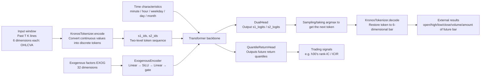
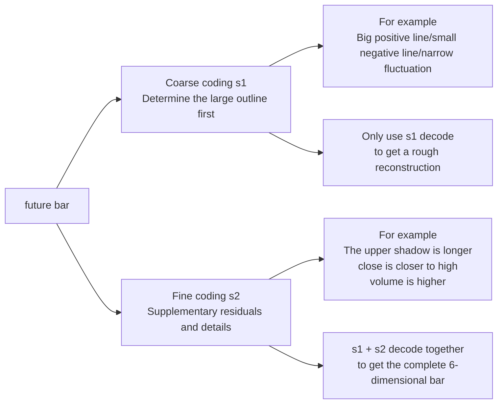

# Kairos

> Seize **the right moment**.
>
> **Kairos** is a **multi-market fine-tuning and deployment toolbox** built on top of the [Kronos](https://github.com/shiyu-coder/Kronos) foundation model.
> It includes data collection, feature engineering, exogenous-channel extensions, quantile-return heads, cross-market backtests, one-command Hugging Face deployment, and a FastAPI inference service.

<p align="center">
<em>Kronos handles time · Kairos handles opportunity</em>
</p>

---

## ✨ Features

- **multi-market data layer** — unified `MarketAdapter` abstraction, built-in A-shares (akshare multi-source fallback), crypto (ccxt OKX perpetual / Binance Vision mirror) two adapters, can be extended to Binance / Bybit / foreign exchange / gold, etc.
- **Shared factor schema** — 24-dimensional common factor + 8-dimensional market-specific factor = fixed 32-dimensional `EXOG_COLS`, **the same model checkpoint reusable across markets**, no future information leakage
- **Model** — `KronosWithExogenous`: Add exogenous variable bypass channel + quantile regression head on top of Kronos, **fully compatible with pre-training weights** (136 of the 147 layers can be directly reused)
- **Training** — DDP training started by `torchrun`, progressive unfreezing + early stopping + OneCycleLR + pinball loss; full env override (`KAIROS_BATCH_SIZE`, etc.) can adjust parameters without changing the code
- **backtest** — `backtest_ic` reads `meta.json` directly, auto-detects market/freq, supports `--baseline` comparisons against original Kronos weights, and reports IC / Rank-IC / ICIR for overall, by-date, and by-hour buckets
- **Deployment** — One-click push to Hugging Face Hub + FastAPI real-time inference service

---

## 🧭 Where To Start

This README only keeps the **project overview, getting-started entry points, current results, and core architecture**. Detailed workflows, experiment logs, and the research roadmap live in `docs/`.

| What you want to do now | Which document to read first |
|---|---|
| First time in the repository and want to see the document map | [docs/DOCUMENTATION_INDEX.md](docs/DOCUMENTATION_INDEX.md) |
| Quickly understand terminology, metrics, and project background | [docs/CONCEPTS_AND_GLOSSARY.md](docs/CONCEPTS_AND_GLOSSARY.md) |
| Reproduce experiments on a remote GPU | [docs/AUTODL_REMOTE_TRAINING_GUIDE.md](docs/AUTODL_REMOTE_TRAINING_GUIDE.md) |
| Run crypto data collection, training, or backtests | [docs/CRYPTO_DATA_SOURCE_AND_EXCHANGE_GUIDE.md](docs/CRYPTO_DATA_SOURCE_AND_EXCHANGE_GUIDE.md) |
| Review completed experiments | [docs/CRYPTO_BTC_ETH_2Y_SPOT_RUN.md](docs/CRYPTO_BTC_ETH_2Y_SPOT_RUN.md), [docs/CRYPTO_TOP100_1Y_SPOT_RUN.md](docs/CRYPTO_TOP100_1Y_SPOT_RUN.md), [docs/CRYPTO_OKX_PERP_TOP10_30D_RUN_POSTMORTEM.md](docs/CRYPTO_OKX_PERP_TOP10_30D_RUN_POSTMORTEM.md) |
| See the current roadmap and next steps | [docs/PROJECT_ROADMAP_AND_NEXT_STEPS.md](docs/PROJECT_ROADMAP_AND_NEXT_STEPS.md) |

---

## 📈 Core results

### Crypto 1-Minute Fine-Tuning

**h30 comparison of four runs** (horizon alignment preset `return_horizon=30`; hardware: single card RTX 5090):

| Run date | Universe | Training interval | Test sample size | Rank-IC (baseline → finetuned) | **ICIR (baseline → finetuned)** | Hit rate | Details |
|---|---|---|---|---|---|---|---|
| 2026-04-17 |BTC + ETH (2 coins)| 2024-01 ~ 2026-04 |300,000| +0.018 → **+0.050** | +0.039 → **+0.325** | 51.7% | [CRYPTO_BTC_ETH_2Y_SPOT_RUN.md](docs/CRYPTO_BTC_ETH_2Y_SPOT_RUN.md) |
| 2026-04-20 |Binance Spot Top100 (100 coins)| 2025-04 ~ 2026-04 |1.1 million| +0.000 → **+0.030** | −0.084 → **+0.454** | 49.2% | [CRYPTO_TOP100_1Y_SPOT_RUN.md](docs/CRYPTO_TOP100_1Y_SPOT_RUN.md) |
| 2026-04-21 |BTC + ETH (2 coins, `Kronos-base`)| 2024-01 ~ 2026-04 |300,000| +0.055 → **+0.076** | +0.325 → **+0.484** | 52.9% | [Shadowell/Kairos-base-crypto](https://huggingface.co/Shadowell/Kairos-base-crypto) |
| 2026-04-20 ⚠️ | OKX **perpetual Top10** (first run with real funding/basis) | 2026-03-21 ~ 2026-04-17 (30d) | 40,000 | +0.008 → +0.016 (n=3 noise) | +1.17 → +0.06 (n=3 noise) | 50.9% | [CRYPTO_OKX_PERP_TOP10_30D_RUN_POSTMORTEM.md](docs/CRYPTO_OKX_PERP_TOP10_30D_RUN_POSTMORTEM.md) (**post-mortem**) |

- **ICIR rises from 0.325 to 0.454** (+40%). The Top100 run pushes signal stability past the 0.4 line, which is the main reason it matters.
- **`Kronos-base` reaches `rank-IC=+0.076 / ICIR=+0.484`** on the same BTC/ETH dataset, suggesting the current bottleneck is not only the universe size but also model capacity.
- The absolute rank-IC drops from 5% to 3% on Top100. Many smaller coins have weaker 30-minute directional alpha than BTC/ETH, so single-name alpha is diluted while cross-sectional relative-strength alpha becomes more important.
- **h1 / h5 are still weak**. The `binance_vision` mirror does not provide funding / OI / basis, so several short-horizon microstructure factors are padded to zero. In the Top100 run, h1/h5 are even learned as reverse signals. See `CRYPTO_TOP100_1Y_SPOT_RUN.md` §7.5 and the tuning guide for follow-up directions.
- **The perpetual Top10 30d run is a failure case, not a success story.** It is the first run with real non-zero `funding_rate` and `basis` in the 32-dimensional exogenous feature set, but it suffered negative transfer because of leftover `KAIROS_N_TRAIN_ITER=5000`, an overly short 3-day test window, and the wrong bucket choice. The code path itself did not regress. See [CRYPTO_OKX_PERP_TOP10_30D_RUN_POSTMORTEM.md](docs/CRYPTO_OKX_PERP_TOP10_30D_RUN_POSTMORTEM.md) for the full write-up and [BACKTEST_IC_INTERPRETATION_GUIDE.md](docs/BACKTEST_IC_INTERPRETATION_GUIDE.md) for the positive checklist.

### A-shares daily line (compared to baseline)

After training two versions (time-split v1 + interleave-split v2), the test ICs are all negative. Conclusion: The A-shares daily signal is weak under the ready-made EXOG schema. The next step (adjust weight freezing strategy, change supervision signal, switch to minute level) is written in [docs/TRAINING_TUNING_PLAYBOOK.md](docs/TRAINING_TUNING_PLAYBOOK.md).

### Published model

| Hub repo | Data | Base model | Notes |
|---|---|---|---|
| [`Shadowell/Kairos-small-crypto`](https://huggingface.co/Shadowell/Kairos-small-crypto) 🟢 public | BTC/USDT + ETH/USDT 1-min, 2024-01 ~ 2026-04 | [`NeoQuasar/Kronos-small`](https://huggingface.co/NeoQuasar/Kronos-small) |The checkpoint of row h30 in the above table; the tokenizer reuses the upstream [`NeoQuasar/Kronos-Tokenizer-base`](https://huggingface.co/NeoQuasar/Kronos-Tokenizer-base)|
| [`Shadowell/Kairos-base-crypto`](https://huggingface.co/Shadowell/Kairos-base-crypto) 🟢 public | BTC/USDT + ETH/USDT 1-min, 2024-01 ~ 2026-04 | [`NeoQuasar/Kronos-base`](https://huggingface.co/NeoQuasar/Kronos-base) |`Kronos-base` predictor fine-tuning version; official tokenizer; current h30 `rank-IC=+0.076 / ICIR=+0.484`|

```python
from kairos import KronosTokenizer
from kairos.models import KronosWithExogenous

tok   = KronosTokenizer.from_pretrained("NeoQuasar/Kronos-Tokenizer-base")
model = KronosWithExogenous.from_pretrained("Shadowell/Kairos-small-crypto")
```

---

## 🏗️ Architecture

### Data pipeline (multi-market)

```
 ┌────────────┐   ┌──────────────┐   ┌───────────────────┐
 │ akshare /  │   │ ccxt (OKX    │   │ data-api.binance  │
│ Dongcai/Tencent │ │perpetual,default) │ │ .vision (spot mirror)│ … other adapters
│ Sina │ │ │ │ │
 └─────┬──────┘   └──────┬───────┘   └─────────┬─────────┘
       │ ashare          │ crypto (okx)        │ crypto (binance_vision)
       ▼                 ▼                     ▼
 ┌─────────────────────────────────────────────────────────┐
│ MarketAdapter abstraction (kairos.data.markets) │
 │  • FetchTask / universe / fetch_ohlcv / MARKET_EXOG_COLS │
 └──────────────────────┬──────────────────────────────────┘
                        │   kairos-collect  (--market)
                        ▼
              raw/{market}/{freq}/<symbol>.parquet
                        │
                        ▼
     ┌──────────────────────────────────────────────┐
│ kairos.data.common_features 24-dimensional common factor │
│ adapter.market_features 8-dimensional market factors │
│ ──────────────── = EXOG_COLS (fixed 32 dimensions) ── │
│ kairos.data.prepare_dataset (including meta.json) │
     └────────────────────┬─────────────────────────┘
                          │
                          ▼
       finetune/data/<name>/{train,val,test}_data.pkl + exog_*.pkl + meta.json
```

### training + backtest + deployment

```
 ┌────────────────────────────┐    ┌────────────────────────────┐
 │ kairos.training            │    │ kairos.training            │
│ .train_tokenizer (optional) │ │ .backtest_ic │
 │ .train_predictor           │    │  --baseline  vs  --ckpt    │
│ ├── preset_for(name) │ │ Automatically push from meta.json │
 │  │    ashare-daily /       │    │  market / freq / exog      │
│ │ crypto-1min │ │ output overall + by-date + │
│ ├── DDP (torchrun) │ │ by-hour third bucket │
│ ├── Gradual Thawing + OneCycleLR │ └──────────────┬───────────────┘
 │  ├── early stopping patience=3       │                   │
│ └── KAIROS_* env override parameters │ ▼
 └──────────────┬─────────────┘          artifacts/backtest_*.json
                │
                ▼
   artifacts/checkpoints/predictor/checkpoints/best_model/
                │
       ┌────────┴─────────┐
       ▼                  ▼
 kairos.deploy      kairos.deploy
 .push_to_hf        .serve
 (HF Hub)           (FastAPI /predict)
```

### Kairos vs Kronos: Comparison of data dimensions

The data entry of Kairos is fully backward compatible with the original version of Kronos - only an additional bypass exogenous variable channel `EXOG` (default 32 dimensions) and a quantile regression head are added in addition to the original two channels, without changing the `d_in` of the tokenizer.

|aisle|Kronos Original| Kairos |Fusion method|
|---|---|---|---|
|**Price and Volume** (tokenizer `d_in`)|6D: `open, high, low, close, volume, amount`|**6 dimensions (unchanged)**|→ `KronosTokenizer` BSQ is quantified into `(s1_bits, s2_bits)` token|
|**Timestamp** (TemporalEmbedding)|5D: `minute, hour, weekday, day, month`|**5 dimensions (unchanged)**|→ Add **to the token embedding at the transformer input|
|**Exogenous Factor** (ExogenousEncoder)| — |**32 dimensions `EXOG_COLS`** = 24 common + 8 market-specific|→ `Linear→SiLU→Linear→RMSNorm→gate·tanh`, **added** to token + time embedding; `gate` **zero initialization**, the first step is equivalent to Kronos|
|**Prediction Header**|next-token CE (s1/s2 double header)|**CE (unchanged)** + `QuantileReturnHead` (quantile regression head, plan C)|`CE + quantile_weight · pinball` Joint loss|

### What does input/output look like?

Kairos/Kronos **can be externally decoded into a 6-dimensional continuous value of the future K-line bar**, but **the model internally directly outputs not a 6-dimensional real regression value, but a probability distribution of discrete tokens**. The reason is that `KronosTokenizer` will first compress the `open, high, low, close, volume, amount` of each bar into two-level tokens (`s1`, `s2`). The predictor learns "what is the next token" and then decodes the token back into a continuous K-line.



Before a `crypto-1min` sample enters the model, it can be roughly understood as:

- `x`: `[289, 6]`, where `289 = lookback_window 256 + predict_window 32 + 1`
- `stamp`: `[289, 5]`
- `exog`: `[289, 32]`

During training, the tokenizer will first compile `x` into `s1_ids` / `s2_ids`, and then what is actually fed to the predictor is the shifted one:

- `s1_in`, `s2_in`: past token sequence
- `stamp_in`: Aligned temporal characteristics
- `exog_in`: Aligned 32-dimensional exogenous factors

The direct output of the model is divided into two channels:

- `s1_logits`, `s2_logits`: The probability distribution of the next token, used to generate/decode future K-line bars
- `quantiles`: future income quantile, used to make backtest signals such as `h30`

### Why split it into `s1` and `s2`

`s1/s2` It is not repeated prediction twice, but **hierarchical quantification**:

- `s1`: First determine the **rough structure** of the bar, such as the approximate price range, volatility level, volume and price pattern
- `s2`: After `s1` has been determined, add **detailed residuals**

This is easier to train than "predict a very large vocab all at once":

- Do rough classification first, then fine classification, the classification space will be smaller
- `s2` It is clear that the conditions are on `s1`, and the modeling difficulty is lower
- Only `s1` can get a thicker reconstruction, `s1+s2` together is the complete bar



It can be understood as:

- `s1` Like first answer "What type of bar is this bar probably?"
- `s2` Then answer "Which specific type is in this category?"

In this way, the predictor does not need to blindly guess in a huge discrete space at once, but first grasps the main structure and then fills in the details.

The specific composition of 32-dimensional `EXOG_COLS` (codes are in [`kairos/data/common_features.py`](kairos/data/common_features.py) and `kairos/data/markets/<name>.py`):

|Group|Dimensions|Listing (excerpt)|
|---|---|---|
|common·yield| 3 | `log_ret_1 / 5 / 20` |
|common · momentum| 4 | `rsi_14, macd_hist, roc_5, roc_20` |
|common · Volatility| 3 | `atr_14, parkinson_20, vol_std_20` |
|common · moving average deviation| 3 | `ma{5,20,60}_dev` |
|common · Bollinger/Volume and Price| 5 | `boll_z, obv_z, mfi_14, amount_z, vwap_dev` |
|common · Candle microstructure| 4 | `amplitude, upper_shadow, lower_shadow, body_ratio` |
|common · reserved pad| 2 | `pad_common_0, pad_common_1` |
| **market-specific**(A-shares) | 8 | `turnover, turnover_z, is_quarter_end, days_to_holiday, excess_ret_index, index_ret, pad_ashare_0, pad_ashare_1` |
| **market-specific**(crypto) | 8 | `funding_rate, funding_rate_z, oi_change, basis, btc_dominance, hour_sin, hour_cos, pad_crypto_0` |

**Why can one set of checkpoints be used across markets**

- The common 24 dimension only relies on OHLCV and any market can be calculated.
- Each market adapter strictly contributes 8 dimensions of market-specific factors - Phase 2 architectural hard constraints (`build_features` direct assert).
- The model side `n_exog=32` is consistent for all markets; if you want to replace factors, occupy the pad slot or replace a certain slot, and **never expand the dimension**.
- Result: The same checkpoint can be loaded and run on A-shares / crypto / future foreign exchange gold, with zero cost for weight migration; when loading Kronos official weights, 136 of the 147 layers can be directly reused, and only `exog_encoder` + `return_head` require random initialization.

---

## 🚀 Quick start

### Install

```bash
git clone https://github.com/Shadowell/Kairos.git
cd Kairos
pip install -e '.[serve,train]'
```

Requirements: Python ≥ 3.10, PyTorch ≥ 2.0.

### 1. Collect data

Kairos' data layer selects the market adapter through the `--market` parameter (default `ashare`):

```bash
# A-shares (default, original behavior unchanged)
kairos-collect --universe csi300 --freq daily \
    --start 2018-01-01 --adjust qfq --out ./raw/daily

# Index data for relative return factors
kairos-collect --universe 000300 --freq daily --adjust qfq --out ./raw/index

# crypto (OKX USDT perpetual) - need to install crypto additional dependencies first
pip install -e '.[crypto]'
kairos-collect --market crypto \
    --universe "BTC/USDT:USDT,ETH/USDT:USDT" \
    --freq 1min --start 2023-01-01 --end 2025-01-01 \
    --out ./raw/crypto/1min --workers 1
```

For the complete crypto workflow (agent, API key, custom exchange), see [docs/CRYPTO_DATA_SOURCE_AND_EXCHANGE_GUIDE.md](docs/CRYPTO_DATA_SOURCE_AND_EXCHANGE_GUIDE.md).

### 2. Generate training set

```bash
# A-shares (daily, traditional time-split)
kairos-prepare \
    --raw ./raw/daily \
    --raw-index ./raw/index/000300.parquet \
    --train 2018-01-01:2023-12-31 \
    --val   2024-01-01:2024-12-31 \
    --test  2025-01-01:2026-04-17 \
    --out   ./artifacts/datasets

# crypto 1min (interleave-split, more suitable for high frequency)
kairos-prepare --market crypto \
    --raw ./raw/crypto/1min \
    --train 2024-01-01:2025-12-31 \
    --val   2024-01-01:2025-12-31 \
    --test  2026-01-01:2026-04-17 \
    --split-mode interleave --val-ratio 0.15 --block-days 7 --seed 42 \
    --out ./finetune/data/crypto_1min
```

### 3. Training (single card is enough)

```bash
# Method 1: Change preset (recommended)
export KAIROS_PRESET=crypto-1min        # or share-daily
export KAIROS_DATASET=./finetune/data/crypto_1min
torchrun --standalone --nproc_per_node=1 -m kairos.training.train_predictor

# Method 2: Temporarily use env to overwrite a single parameter (no need to change the code)
KAIROS_BATCH_SIZE=32 KAIROS_LR=5e-6 \
    torchrun --standalone --nproc_per_node=1 -m kairos.training.train_predictor

# Optional: fine-tuning Tokenizer first (usually not necessary, just use the official version of NeoQuasar;
# For the complete process and evaluation script, see docs/CRYPTO_BTC_ETH_TOKENIZER_RUN.md)
torchrun --standalone --nproc_per_node=1 -m kairos.training.train_tokenizer
python -m kairos.training.eval_tokenizer --baseline --preset crypto-1min \
    --dataset-path ./finetune/data/crypto_1min \
    --out artifacts/tokenizer_eval_baseline.json
python -m kairos.training.eval_tokenizer \
    --ckpt artifacts/checkpoints/tokenizer/checkpoints/best_model \
    --preset crypto-1min --dataset-path ./finetune/data/crypto_1min \
    --out artifacts/tokenizer_eval_finetuned.json
```

### 4. Backtest comparison

```bash
# baseline = Kronos original weight + randomly initialized exog / return head
python -m kairos.training.backtest_ic --baseline --preset crypto-1min \
    --dataset-path ./finetune/data/crypto_1min \
    --horizons 1,5,30 --out artifacts/backtest_baseline.json

# finetuned
python -m kairos.training.backtest_ic \
    --ckpt artifacts/checkpoints/predictor/checkpoints/best_model \
    --preset crypto-1min \
    --dataset-path ./finetune/data/crypto_1min \
    --horizons 1,5,30 --out artifacts/backtest_finetuned.json
```

### 5. Push to Hugging Face

```bash
huggingface-cli login   # or export HF_TOKEN=...

# 5.1 Only push tokenizer
kairos-push-hf \
    --tokenizer-ckpt artifacts/checkpoints/tokenizer/checkpoints/best_model \
    --repo-tokenizer your-user/Kronos-Tokenizer-crypto \
    --market-tag crypto \
    --metrics-file artifacts/tokenizer_eval_summary.md

# 5.2 Only push predictor (reuse upstream tokenizer)
kairos-push-hf \
    --predictor-ckpt artifacts/checkpoints/predictor/checkpoints/best_model \
    --repo-predictor your-user/Kronos-small-ashare \
    --predictor-class ext --market-tag ashare

# 5.3 Push two at a time
kairos-push-hf \
    --tokenizer-ckpt artifacts/checkpoints/tokenizer/checkpoints/best_model \
    --predictor-ckpt artifacts/checkpoints/predictor/checkpoints/best_model \
    --repo-tokenizer your-user/Kronos-Tokenizer-ashare \
    --repo-predictor your-user/Kronos-small-ashare \
    --predictor-class ext --private
```

### 6. Start FastAPI service

```bash
kairos-serve \
    --tokenizer your-user/Kronos-Tokenizer-ashare \
    --predictor your-user/Kronos-small-ashare \
    --device cuda:0 --port 8000

# call
curl -X POST http://localhost:8000/predict -H "Content-Type: application/json" -d '{
  "symbol": "600977", "lookback": 400, "pred_len": 20,
  "T": 0.6, "top_p": 0.9, "sample_count": 5
}'
```

---

## 🧬 Three model modification options

Kairos implements **Scheme A + Scheme C** by default, which can be used out of the box. See [docs/TRAINING_TUNING_PLAYBOOK.md](docs/TRAINING_TUNING_PLAYBOOK.md) for details.

|plan|practice|cost|Reuse pre-training|
|---|---|---|---|
|**A: Exogenous bypass channel**|32-dimensional factor `Linear→SiLU→Linear→gate` added to token embedding|Low|✅ Fully compatible|
|**B: Tokenizer retraining**|Expand `d_in` to 12~20, retrain Tokenizer and Predictor|High (~¥2-5k)| ❌ |
| **C: quantile regression head** |The last layer hidden is connected to the bit header and uses pinball loss.|Low| ✅ |

---

## 🗺️ Current roadmap

The research backlog, priorities and acceptance criteria have been split from the README into separate documents:

- [docs/PROJECT_ROADMAP_AND_NEXT_STEPS.md](docs/PROJECT_ROADMAP_AND_NEXT_STEPS.md) — Current roadmap, priority, acceptance criteria, time estimate
- [docs/CRYPTO_OKX_PERP_TOP10_30D_RUN_POSTMORTEM.md](docs/CRYPTO_OKX_PERP_TOP10_30D_RUN_POSTMORTEM.md) — Complete post-mortem of a recent failed experiment
- [docs/TRAINING_TUNING_PLAYBOOK.md](docs/TRAINING_TUNING_PLAYBOOK.md) — Troubleshooting experience in tuning and reusing across experiments
- [docs/BACKTEST_IC_INTERPRETATION_GUIDE.md](docs/BACKTEST_IC_INTERPRETATION_GUIDE.md) — indicator reading and backtest sanity check

In this way, the README only answers "what is the project, how did it start, and what is the current situation" and no longer carries a detailed research plan.

---

## 📚 document entrance

See [docs/DOCUMENTATION_INDEX.md](docs/DOCUMENTATION_INDEX.md) for the complete document map. Here are the most commonly used entries:

| document |effect|
|---|---|
| [docs/DOCUMENTATION_INDEX.md](docs/DOCUMENTATION_INDEX.md) |Find documents by tasks and roles to solve "Which article should I read now?"|
| [docs/CONCEPTS_AND_GLOSSARY.md](docs/CONCEPTS_AND_GLOSSARY.md) |Unified explanation of terms, indicators, and core concepts|
| [docs/AUTODL_REMOTE_TRAINING_GUIDE.md](docs/AUTODL_REMOTE_TRAINING_GUIDE.md) |Standard process of local development + remote GPU training|
| [docs/CRYPTO_DATA_SOURCE_AND_EXCHANGE_GUIDE.md](docs/CRYPTO_DATA_SOURCE_AND_EXCHANGE_GUIDE.md) |crypto data collection, exchange configuration, proxy and extension entrance|
| [docs/BACKTEST_IC_INTERPRETATION_GUIDE.md](docs/BACKTEST_IC_INTERPRETATION_GUIDE.md) |How to choose backtest parameters, how to read the results, and which indicators cannot be misused|
| [docs/TRAINING_TUNING_PLAYBOOK.md](docs/TRAINING_TUNING_PLAYBOOK.md) |Training parameter adjustment, common pitfalls, repair ideas and experience summary|
| [docs/PROJECT_ROADMAP_AND_NEXT_STEPS.md](docs/PROJECT_ROADMAP_AND_NEXT_STEPS.md) |Current research roadmap and next steps|
| [AGENTS.md](AGENTS.md) |Repository operation rules, mainly used by AI coding agent|

---

## 📂 Project structure

```
Kairos/
├── README.md / LICENSE / pyproject.toml / requirements.txt
├── AGENTS.md                         ← AI coding agent repository operation manual
├── .env.example                      ← Environment variable template (API key/proxy/HF)
├── docs/
│   ├── DOCUMENTATION_INDEX.md                 ← documents navigation: find documents by tasks and roles
│   ├── PROJECT_ROADMAP_AND_NEXT_STEPS.md     ← Current research roadmap, priorities, acceptance criteria
│   ├── CONCEPTS_AND_GLOSSARY.md              ← Unified explanation of terms and concepts
│   ├── TRAINING_TUNING_PLAYBOOK.md           ← Training Participation Troubleshooting Manual
│   ├── BACKTEST_IC_INTERPRETATION_GUIDE.md   ← IC/Rank-IC/ICIR configuration and interpretation guide
│   ├── AUTODL_REMOTE_TRAINING_GUIDE.md       ← Remote GPU training and checkpoint return workflow
│   ├── CRYPTO_DATA_SOURCE_AND_EXCHANGE_GUIDE.md ← crypto data source, exchange and network configuration guide
│   ├── CRYPTO_BTC_ETH_2Y_SPOT_RUN.md         ← BTC+ETH 2 years spot predictor run log
│   ├── CRYPTO_TOP100_1Y_SPOT_RUN.md          ← Top100 1 year spot predictor run log
│   ├── CRYPTO_OKX_PERP_MULTICHANNEL_PLAN.md  ← OKX perpetual multi-channel transformation plan
│   ├── CRYPTO_OKX_PERP_TOP10_30D_RUN_POSTMORTEM.md ← OKX perpetual Top10 30-day experiment post-mortem
│   └── CRYPTO_BTC_ETH_TOKENIZER_RUN.md       ← BTC+ETH tokenizer fine-tuning and evaluation records
├── kairos/                           ← Python package (only import entry)
│   ├── __init__.py                   ← Top-level re-export
│   ├── data/
│   │   ├── collect.py                ← multi-market CLI dispatcher (kairos-collect)
│   │   ├── common_features.py        ← 24-dimensional common factor
│   │   ├── crypto_extras.py          ← funding/OI/spot sidecar loading
│   │   ├── features.py               ← assembly common + adapter specific = 32 dimensions
│   │   ├── prepare_dataset.py        ← Generate train/val/test.pkl + meta.json
│   │   └── markets/                  ← MarketAdapter abstraction + share/crypto implementation
│   │       └── crypto_exchanges/     ← ccxt package: okx/binance_vision/…
│   ├── models/
│   │   └── kronos_ext.py             ← KronosWithExogenous + QuantileReturnHead
│   ├── training/
│   │   ├── config.py                 ← TrainConfig + preset_for(name)
│   │   ├── dataset.py                ← KronosDataset (common across markets)
│   │   ├── train_tokenizer.py
│   │   ├── train_predictor.py        ← Support KAIROS_* env to override super parameters
│   │   └── backtest_ic.py            ← IC/Rank-IC/ICIR, supports --baseline
│   ├── deploy/
│   │   ├── push_to_hf.py
│   │   └── serve.py
│   ├── utils/
│   │   └── training_utils.py         ← DDP / Seeds / Tools
│   └── vendor/kronos/                ← Official Kronos model source code (vendored)
├── scripts/
│   ├── autodl_bootstrap.sh           ← AutoDL one-command initialization (venv + hf mirror + smoke)
│   ├── package_and_upload.sh         ← Package + scp to AutoDL
│   └── smoke_crypto_extras.py        ← crypto extras offline smoke test
├── examples/
│   ├── inference_quickstart.py       ← Reasoning quickly getting started
│   └── crypto_top100_universe.md     ← Top100 frozen list (2026-04-20 snapshot)
└── tests/
    ├── test_features.py
    ├── test_ashare_adapter.py
    ├── test_binance_vision.py
    ├── test_crypto_adapter.py
    └── test_multi_market.py
```

---

## 📋 CLI quick check

|Order|effect|
|---|---|
| `kairos-collect --market {ashare,crypto}` |multi-market K-line collection (akshare/ccxt)|
| `kairos-prepare --market {ashare,crypto}` |Generate train/val/test pkl + `meta.json`, support time-split / interleave-split|
| `kairos-train-tokenizer` |fine-tuning Tokenizer (optional, usually use the official version directly)|
| `kairos-train-predictor` |fine-tuning Predictor (scheme A+C); read `KAIROS_PRESET / KAIROS_DATASET / KAIROS_*` env|
| `python -m kairos.training.backtest_ic` | backtest: `--baseline` vs `--ckpt`, IC / Rank-IC / ICIR |
| `kairos-push-hf` |Upload checkpoint to HuggingFace Hub|
| `kairos-serve` |Starting from FastAPI inference service|

### Commonly used env variables

|variable|default|illustrate|
|---|---|---|
| `KAIROS_PRESET` | `ashare-daily` |The default name registered in `preset_for(name)`, e.g. `crypto-1min`|
| `KAIROS_DATASET` |path in preset|Training/backtest data directory (`kairos-prepare`’s `--out`)|
| `KAIROS_BATCH_SIZE` / `KAIROS_LR` / `KAIROS_EPOCHS` / `KAIROS_NUM_WORKERS` |preset default|You can scan parameters without changing the code; see `train_predictor.py` for the complete list|
| `KAIROS_SMOKE=1` | — |For local CPU smoke test, 50 step × batch 4|
| `HF_ENDPOINT=https://hf-mirror.com` | — |Recommended in mainland China, use hf-mirror|

---

## 📜 License

MIT License · See [LICENSE](LICENSE).

This project vendors the [Kronos](https://github.com/shiyu-coder/Kronos) original model code under `kairos/vendor/kronos/`, which is also under the MIT license.

## 🙏 Thanks

- [Kronos: A Foundation Model for the Language of Financial Markets](https://arxiv.org/abs/2508.02739) — The model basis of this project
- [akshare](https://github.com/akfamily/akshare) — data source
- [Hugging Face](https://huggingface.co/) — Model hosting
